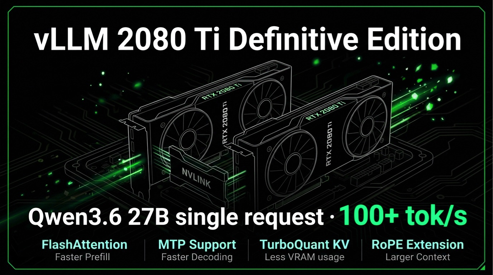

<!-- markdownlint-disable MD001 MD041 -->
# ⚡ vLLM 2080 Ti Definitive Edition



The definitive vLLM runtime for dual RTX 2080 Ti / SM75 serving.

This is a hardware-focused fork that preserves the patched source, launch
profiles, and runtime notes needed to reproduce the working 2080 Ti vLLM stack.

Fork release: `v0.1.6`
Base vLLM: `0.21.0`

Headline evidence: Qwen3.6 27B reaches `100+ tok/s` single-request decode, and
Gemma4 31B reaches `~100 tok/s` single-request decode on the same dual 2080 Ti
TP=2 runtime.

Language: English | [简体中文](README.zh-CN.md)


## 💡 Why RTX 2080 Ti for LLM Inference?

In August 2018, NVIDIA launched the RTX 2080 Ti and moved the enthusiast GPU
line from GTX into the RTX era. Years later, the card is still remembered as a
landmark Turing design. With 22GB memory mods, NVLink, high memory bandwidth,
and enough raw compute to remain relevant, dual 2080 Ti cards turn out to be a
surprisingly strong local AI inference platform.

| Metric | 2x 2080 Ti 22GB + NVLink | 3090 Ti 24GB baseline | Ratio |
|---|---:|---:|---:|
| Physical CUDA core count | 8,704 | 5,376 | 1.62x |
| SM count | 136 | 84 | 1.62x |
| Physical Tensor Core count | 1,088 | 336 | 3.24x |
| Dense Tensor FP16 matrix throughput | 228 TFLOPS | 160 TFLOPS | 1.43x |
| Total physical memory bandwidth | 1,232 GB/s | 1,008 GB/s | 1.22x |
| Total VRAM capacity | 44GB | 24GB | 1.83x |
| Secondary-market price anchor | about $550 with NVLink | about $1,100 | about 0.5x |

The project is built around a simple cost/performance bet: use roughly half the
secondary-market price of an RTX 3090 Ti to get a dual 22GB RTX 2080 Ti setup
that can match or exceed it on the physical resources that matter for LLM
serving, then use vLLM runtime work to turn those resources into real tokens.

That is the first value of this fork: take old but strong Turing silicon and
make it behave like a serious 27B/31B-class inference platform through Marlin,
FlashQLA/FlashInfer/FA2, TurboQuant/INT8 KV, MTP, and CUDAGraph integration.

## 🧩 Core Routes

Serving shape:

- This project optimizes for extreme single-concurrency performance on dual
  2080 Ti: one personal-agent style workload, one serious 27B/31B model, and
  the largest practical context window this hardware can sustain.
- It is not a multi-tenant serving stack. Multi-agent use is supported best as
  queued workspace isolation, not as parallel long-prefill throughput. Long
  prefill work is capacity-safe when tuned, but it is effectively serialized by
  the runtime scheduler on this TP=2 profile.

Status: 🟢 validated support; 🟡 experimental or partial support; 🔴 known
failure or clear regression; ⚪ not a target preset or not yet validated.

### Qwen3.6 27B Mature Route

Qwen-family 27B is the primary production route for this fork. It has the most
complete coverage across FP8/INT4/NVFP4 Marlin-family weights, MTP, FP16/INT8 KV,
native 256K context, YaRN capacity profiles, and image-serving compatibility.
Fast path: Qwen uses FlashQLA-SM70-SM75 for Gated DeltaNet / linear-attention
prefill, FlashInfer / FA2 for full-attention prefill, head_dim=256 fast-path
controls, and MTP with CUDAGraph for decode.

| Feature | FP16 KV | INT8 KV | TurboQuant KV |
|---|---|---|---|
| Marlin weight route | 🟢 FP8/INT4/NVFP4 | 🟢 FP8/INT4/NVFP4 | 🟢 FP8/INT4/NVFP4 |
| MTP decoding | 🟢 supported | 🟡 experimental fast mode | 🟡 experimental |
| Native 256K context | 🟢 text route | 🟢 text route | 🟡 not a preset |
| YaRN 512K extension | ⚪ not the target route | 🟢 supported capacity route | ⚪ not a preset |
| No-eager / CUDAGraph | 🟢 supported | 🟢 supported | 🟢 graph-safety fixed |
| Fast prefill path | 🟢 FlashInfer / FA2 | 🟢 FlashInfer / INT8 path | 🟡 route-specific |
| Multimodal image serving | 🟢 FP8/INT4 routes | 🟡 INT4 route only | 🔴 not promoted |
| Current preset status | 🟢 recommended | 🟢 recommended | 🟡 experimental only |

### Gemma4 31B Experimental Route

Gemma4 31B is kept as a secondary experimental route. Capability support and
profile promotion are separated here: MTP and fast prefill have benchmark
evidence on the FP16/default-KV GPTQ + assistant route, but Gemma profiles are
not promoted as production presets yet. FP16/default KV can run 64K noMTP,
while compressed-KV 256K routes are still blocked by upstream Gemma KV behavior.

| Feature | FP16 KV | INT8 KV | TurboQuant KV |
|---|---|---|---|
| Marlin weight route | 🟢 GPTQ target | 🟢 GPTQ target | 🟢 GPTQ target |
| MTP decoding | 🟢 tested route | ⚪ no preset | ⚪ no preset |
| Validated context | 🟡 64K text route | 🔴 init issue | 🔴 capacity shortfall |
| No-eager / CUDAGraph | 🟢 supported | 🟡 fallback issue | 🟡 admission limited |
| Fast prefill path | 🟢 FlashInfer / FA2 | 🟡 backend-dependent | 🟡 backend-dependent |
| Multimodal image serving | ⚪ no validated preset | ⚪ no validated preset | ⚪ no validated preset |
| Current preset status | 🟡 experimental only | ⚪ no preset | ⚪ no preset |

## 🧪 Tested Model Checkpoints

This section records checkpoint-level validation. It is intentionally stricter
than "vLLM can load it": a supported checkpoint can start and generate, while a
recommended checkpoint also has a useful throughput/context tradeoff on dual 2080 Ti.

| Model route | Weight route | Model cards | Status |
|---|---|---|---|
| Qwen3.6 27B FP8 | FP8 | [Qwen/Qwen3.6-27B-FP8](https://huggingface.co/Qwen/Qwen3.6-27B-FP8)<br>[Jackrong/Qwopus3.6-27B-v2-FP8](https://huggingface.co/Jackrong/Qwopus3.6-27B-v2-FP8) | 🟢 Recommended |
| Qwen3.6 27B AWQ | AWQ-INT4 | [mconcat/Qwopus3.6-27B-v2-AWQ-4bit](https://huggingface.co/mconcat/Qwopus3.6-27B-v2-AWQ-4bit)<br>[QuantTrio/Qwen3.6-27B-AWQ](https://huggingface.co/QuantTrio/Qwen3.6-27B-AWQ) | 🟢 Recommended |
| Qwen3.6 27B GPTQ | GPTQ-INT4 | [llmfan46/Qwen3.6-27B-uncensored-heretic-v2-Native-MTP-Preserved-GPTQ-Int4](https://huggingface.co/llmfan46/Qwen3.6-27B-uncensored-heretic-v2-Native-MTP-Preserved-GPTQ-Int4) | 🟢 Recommended |
| Qwen3.6 27B NVFP4 | NVFP4 | [unsloth/Qwen3.6-27B-NVFP4](https://huggingface.co/unsloth/Qwen3.6-27B-NVFP4) | 🟡 Supported |
| Qwen3.6 27B Quark INT8 | Quark-INT8 | [nameistoken/Qwen3.6-27B-Quark-W8A8-INT8](https://huggingface.co/nameistoken/Qwen3.6-27B-Quark-W8A8-INT8) | 🟡 Supported |
| Qwen3.6 27B AutoRound | AutoGPTQ-INT8 | [Minachist/Qwen3.6-27B-INT8-AutoRound](https://huggingface.co/Minachist/Qwen3.6-27B-INT8-AutoRound)<br>[Minachist/Qwen3.6-27B-INT8-AutoRound W8A16-GS128](https://huggingface.co/Minachist/Qwen3.6-27B-INT8-AutoRound/tree/W8A16-GS128) | 🟡 Supported |
| Gemma4 31B GPTQ | GPTQ-INT4 + assistant draft | [ebircak/gemma-4-31B-it-4bit-W4A16-GPTQ](https://huggingface.co/ebircak/gemma-4-31B-it-4bit-W4A16-GPTQ) | 🟡 Supported |

## 🛠️ Target Hardware & Runtime

- Validated GPU profile: dual RTX 2080 Ti 22GB, SM75, NVLink, tensor parallel
  size 2
- CUDA/PyTorch: CUDA 12.8, `torch 2.11.0+cu128`
- Fork release: `v0.1.6`
- Base vLLM: `0.21.0`
- Repository identity: `vllm-2080ti-definitive`
- Runtime identity: `vllm-sm75-tp2-cu128`
- Compatibility target: NVIDIA Turing / SM75 GPUs. Other Turing cards still
  need profile validation for VRAM capacity, P2P/NVLink behavior, model
  head_dim, KV dtype, and CUDAGraph/MTP settings.

## 🚀 How To Use

For a source checkout:

```bash
./build.sh
./launcher.sh
```

Then choose three things in the launcher:

1. Checkpoint directory
2. Profile path, starting from [profiles/README.md](profiles/README.md)
3. Port and local/LAN access

A successful launch prints an OpenAI-compatible API URL. For scripted use:

```bash
MODEL_DIR=/path/to/qwen-or-gemma-checkpoint \
PROFILE=qwen27b/safe/int4/fp16kv-256K-mtp3-text-only.env \
MODE=safe \
PORT=8000 \
SERVICE_SCOPE=lan \
CUDA_VISIBLE_DEVICES=0,1 \
./launcher.sh --non-interactive
```

Profiles declare compatible modes, not a recommended launch mode. Set
`MODE=safe`, `MODE=normal`, or `MODE=fast` explicitly when you want a specific
mode; the launcher validates that choice against the profile.

## 🧭 Profiles

Start from [Profile Guide](profiles/README.md). Profiles are organized as
`profiles/<model>/<mode>/<weight>/<route>.env`, for example
`qwen27b/safe/fp8/fp16kv-128K-mtp3-text-only.env` and
`qwen27b/fast/int4/int8kv-256K-mtp3-text-only.env`.

Available modes:

- `safe`: production default. It favors output stability and allows
  FP16/default KV with MTP; quantized KV must use noMTP.
- `normal`: middle mode for diagnostics and manual checks.
- `fast`: high-performance mode. Use it for quantized KV with MTP; it has
  higher memory and quality risk.

## 🚀 MTP And KV Precision

Use the bundled profiles instead of hand-tuning MTP and KV settings first.
MTP is already set to the best practical value for each route. Choose KV by
intent first: FP16/default KV for maximum output quality, INT8 KV for the best
quality/capacity balance, and TQ4NC when compression is the priority.

Detailed benchmark notes are kept in
[MTP Task Sensitivity](docs/mtp-task-sensitivity.md) and
[Qwen3.6 KV Throughput Sweep](docs/qwen36-kv-throughput-sweep.md).

## ❓ Hardware Q&A

**Q: What GPU interconnect is required?**

A: NVLink is recommended, but PCIe P2P is the real baseline requirement. The
validated system uses NVLink and an intentionally non-ideal PCIe topology, with
one card at PCIe 3.0 x1 and the other at PCIe 3.0 x4. With NVLink carrying
GPU-to-GPU traffic, PCIe slot bandwidth is not the main bottleneck. Without
NVLink, do not treat narrow PCIe links as proven sufficient; confirm P2P
behavior and benchmark the actual topology.

**Q: Does the host need a strong CPU or a lot of RAM?**

A: No. The validated path has run on a low-end desktop CPU with 16GB RAM. More
CPU/RAM mainly helps compile cache generation, downloads, and local build work,
not steady-state token generation.

**Q: Which Turing GPUs make sense? Can I mix 11GB and 22GB cards?**

A: The fully validated target is dual RTX 2080 Ti 22GB. Other good candidates
are high-VRAM TU102-class cards: TITAN RTX 24GB, Quadro RTX 6000 24GB, and
Quadro RTX 8000 48GB, preferably in pairs with NVLink or confirmed PCIe P2P.
Mixed 11GB + 22GB RTX 2080 Ti setups are not recommended for these 27B/31B
profiles because vLLM TP=2 is effectively constrained by the smaller rank.
Smaller Turing cards can run smaller models, but they are not the main target
for this stack.

**Q: Which CUDA, PyTorch, and driver versions are validated?**

A: The validated runtime is CUDA 12.8 + `torch 2.11.0+cu128`. Use a recent
NVIDIA driver that supports your host GPUs and is compatible with the CUDA
runtime. Do not mix build/runtime assumptions casually: keep the PyTorch CUDA
lane, local CUDA toolkit, FlashInfer/FlashQLA builds, and launch profile
aligned.

**Q: What other hardware risks matter?**

A: Cooling, power stability, and enough SSD space for model files and compile
caches. Thermal throttling can hide as a software regression, especially during
long prefill or repeated CUDAGraph/AOT compilation runs.

## 🔗 Related Project

- [2080Ti-LLM-Toolbox](https://github.com/weicj/2080Ti-LLM-Toolbox): companion
  toolbox for dual 2080 Ti model routes, benchmark summaries, model notes, and
  operational guidance. This repository focuses on the patched vLLM runtime
  itself.

## 🙏 Credits / Upstream Projects

This repository is a hardware-focused fork of upstream
[vLLM](https://github.com/vllm-project/vllm), licensed under Apache-2.0. The
fork keeps the upstream project structure and adds local SM75 runtime patches,
launch profiles, and validation notes for the dual 2080 Ti route.

Acceleration components used or integrated by this runtime include:

- [vLLM](https://github.com/vllm-project/vllm): base inference engine and
  serving stack.
- [FlashInfer](https://github.com/flashinfer-ai/flashinfer): attention,
  sampling, and quantized kernel paths used by vLLM.
- [QwenLM/FlashQLA](https://github.com/QwenLM/FlashQLA): upstream FlashQLA
  Gated DeltaNet / Qwen3.5 linear-attention implementation.
- [weicj/FlashQLA-SM70-SM75](https://github.com/weicj/FlashQLA-SM70-SM75):
  SM70/SM75 adaptation used by the validated Qwen3.6 prefill profile.
- FlashAttention / FA2, TurboQuant, Marlin, CUTLASS, Triton, and related vLLM
  acceleration kernels: existing open-source acceleration work integrated and
  profiled for this hardware target.
