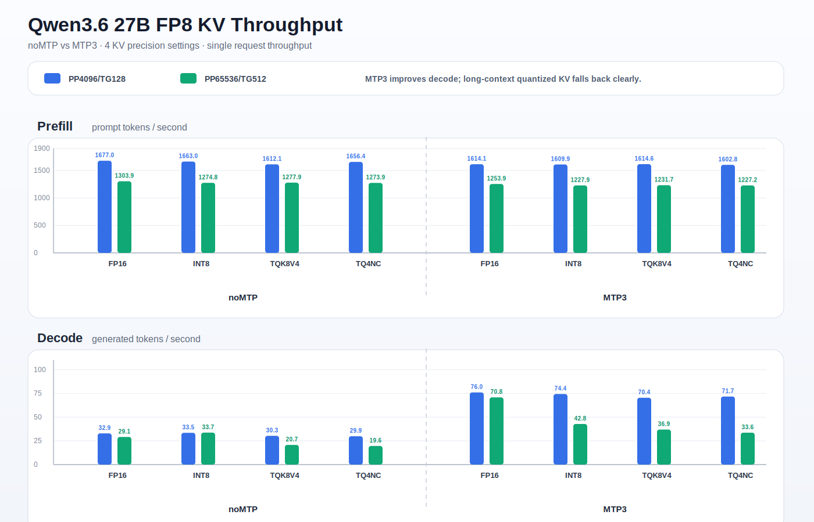
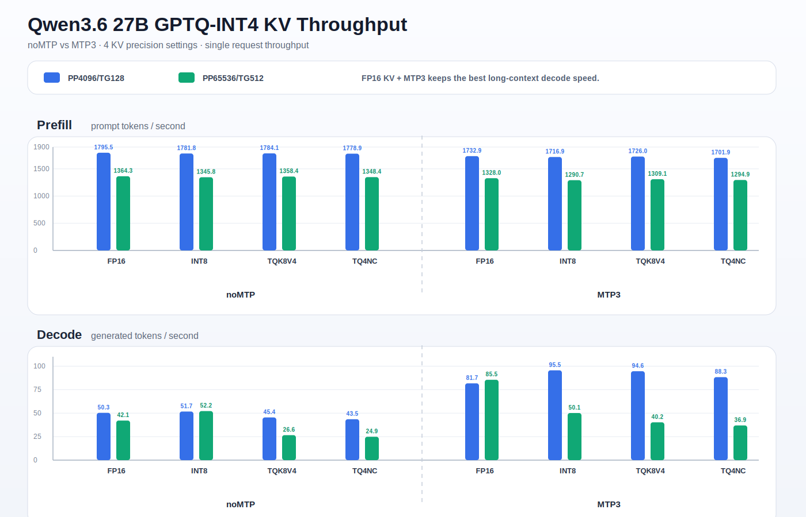

# Qwen3.6 27B KV 吞吐 Sweep

本文记录同一套双 RTX 2080 Ti TP=2 runtime 下，FP8 和 GPTQ-INT4
checkpoint 的 KV 精度吞吐 sweep。吞吐统一写成 `prefill / decode tok/s`。

## 测试矩阵

| Checkpoint 路线 | 模式 | KV 精度 | PP4096/TG128 prefill / decode | PP65536/TG512 prefill / decode |
|---|---|---|---:|---:|
| Qwen3.6 27B FP8 | noMTP | FP16 | 1677.0 / 32.9 | 1303.9 / 29.1 |
| Qwen3.6 27B FP8 | noMTP | INT8 | 1663.0 / 33.5 | 1274.8 / 33.7 |
| Qwen3.6 27B FP8 | noMTP | TQK8V4 | 1612.1 / 30.3 | 1277.9 / 20.7 |
| Qwen3.6 27B FP8 | noMTP | TQ4NC | 1656.4 / 29.9 | 1273.9 / 19.6 |
| Qwen3.6 27B FP8 | MTP3 | FP16 | 1614.1 / 76.0 | 1253.9 / 70.8 |
| Qwen3.6 27B FP8 | MTP3 | INT8 | 1609.9 / 74.4 | 1227.9 / 42.8 |
| Qwen3.6 27B FP8 | MTP3 | TQK8V4 | 1614.6 / 70.4 | 1231.7 / 36.9 |
| Qwen3.6 27B FP8 | MTP3 | TQ4NC | 1602.8 / 71.7 | 1227.2 / 33.6 |
| Qwen3.6 27B GPTQ-INT4 | noMTP | FP16 | 1795.5 / 50.3 | 1364.3 / 42.1 |
| Qwen3.6 27B GPTQ-INT4 | noMTP | INT8 | 1781.8 / 51.7 | 1345.8 / 52.2 |
| Qwen3.6 27B GPTQ-INT4 | noMTP | TQK8V4 | 1784.1 / 45.4 | 1358.4 / 26.6 |
| Qwen3.6 27B GPTQ-INT4 | noMTP | TQ4NC | 1778.9 / 43.5 | 1348.4 / 24.9 |
| Qwen3.6 27B GPTQ-INT4 | MTP3 | FP16 | 1732.9 / 81.7 | 1328.0 / 85.5 |
| Qwen3.6 27B GPTQ-INT4 | MTP3 | INT8 | 1716.9 / 95.5 | 1290.7 / 50.1 |
| Qwen3.6 27B GPTQ-INT4 | MTP3 | TQK8V4 | 1726.0 / 94.6 | 1309.1 / 40.2 |
| Qwen3.6 27B GPTQ-INT4 | MTP3 | TQ4NC | 1701.9 / 88.3 | 1294.9 / 36.9 |

## 结论

- 开启 MTP 时，FP16/default KV 保持最佳长上下文 decode 路线。GPTQ-INT4
  MTP3 在 PP65536/TG512 下达到 `1328.0 / 85.5 tok/s`。
- 未开启 MTP 时，这组 sweep 中 FP16 和 INT8 KV 没有体现出明显长上下文
  decode 速度惩罚。GPTQ-INT4 noMTP FP16 在 PP65536/TG512 下是
  `1364.3 / 42.1 tok/s`，GPTQ-INT4 noMTP INT8 是 `1345.8 / 52.2 tok/s`。
- TurboQuant KV 在短上下文 MTP 测速中仍然很快，但长上下文 decode 会明显
  下降。TQK8V4/TQ4NC 应该在优先追求更大 KV 容量时使用，而不是作为最大
  长上下文 decode 速度路线。
- FP8 MTP3 + INT8 KV 的 PP65536/TG512 行需要贴近请求长度设置
  `MAX_MODEL_LEN=66048`。在这套 22GB/卡环境里，放宽到 `69632` 会 OOM。

## Artifacts

原始 JSONL artifact 和本地 CSV 汇总保留在源码树外。本文档是公开仓库内的
规范化摘要。
